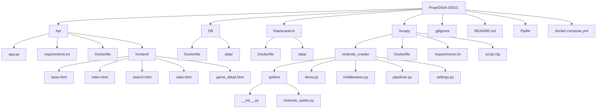

# Projet DSIA-4201C - DataEngineeringTools - Nintendo Dashboard Project

## Résumé

Ce projet a pour objectif d'étudier les données du site de Nintendo et en particulier de la catégorie Jeux en scrapant les données directement sur le site web et en les affichant sur un dashboard. Ces données seront directement stockées dans une BDD (MongoDB). En utilisant les données complètes des différents jeux disponibles sur le site de Nintendo, nous explorons des informations telles que les prix, les dates de sortie, les types de console compatible...
Ce projet scrappe la catégorie "Jeux" du site **Nintendo**, stocke les données dans **MongoDB**, et les affiche dans une interface **Flask**.

## Table des Matières
- [Introduction](#introduction)
- [Architecture du Projet](#architecture-du-projet)
- [Technologies et Choix Techniques](#technologies-et-choix-techniques)
- [Arborescence du Projet](#arborescence-du-projet)
- [Installation et Lancement](#installation-et-lancement)
- [Utilisation](#utilisation)
- [Annexes](#annexes)

## Introduction
Les données sont collectées via un crawler développé avec **Scrapy** et stockées dans une base **MongoDB**.
L’application web est développée en **Flask** et déployée via **Docker Compose**. Elle offre une interface dynamique incluant une page d'accueil, un formulaire de recherche et des statistiques visuelles (graphiques avec Chart.js).

## Architecture du Projet
Le projet est composé de plusieurs services, tous orchestrés par Docker, qui communiquent entre eux :
- **Scrapy** : Extraction des données depuis le site de Nintendo.
- **MongoDB (DB)** : Stockage des données scrapées.
- **API (Flask)** : Application web pour l’affichage des données et l’interaction avec l’utilisateur.

## Technologies et Choix Techniques
- **Python** : Langage utilisé pour développer Scrapy et l’application Flask.
- **Flask** : Framework web léger et extensible, idéal pour construire des dashboards.
- **MongoDB** : Base de données NoSQL pour le stockage des données.
- **Docker & Docker Compose** : Facilite le déploiement et l'orchestration des différents services.
- **Bootstrap & Chart.js** : Utilisés pour la mise en page responsive et la visualisation des statistiques.

## Arborescence du Projet
Voici l’arborescence globale du projet sous forme de diagramme :

## Installation et Lancement

### Prérequis
- **Docker** et **Docker Compose** installés sur votre machine.
- **MongoDB Compass** installé sur votre machine.
- Une connexion Internet pour télécharger les images Docker et les dépendances (c'est mieux...)

### Lancement
- Clonez le dépôt du projet.
- Depuis le répertoire racine du projet, exécutez : docker-compose up --build
- Accédez à l’application via http://localhost:8050.

## Utilisation

- **Page d'accueil** : Affiche un carrousel dynamique de jeux (images, titres, descriptions).
- **Recherche** : Formulaire de recherche des jeux par titre (tapez ce que vous voulez, même un bout de titre ou une licence)
- **Détails d'un jeu** : Dans la partie Recherche, cliquez sur un jeu pour afficher ses informations détaillées (après avoir recherché quelque chose en particulier)
- **Statistiques** : Visualisation graphique (répartition par genre, prix, et classification d'âge)

## Annexes

- **⚠️ Infos importantes** : 
   - ElasticSearch est encore dans l'arborescence du projet et dans certains fichiers car nous avions commencé à essayer de l'implémenter puis nous avons finalement préféré ne pas l'utiliser.
   - Nous avons préféré limiter le nombre de données scrapées afin de ne pas surcharger le temps de chargement lors de l'initialisation avec docker-compose (c'est simplement ici pour que vous puissiez tester plus rapidement et facilement)

- **Bonus** : Les parties suivantes étant "bonus" dans les consignes ont été réalisées:
   - Utilisation de docker-compose
   - Scraping en temps réél

- **Docker Compose** : Le fichier docker-compose.yml orchestre l’ensemble des services
   - scraper : Conteneur pour le crawler Scrapy.
   - api : Application Flask (dashboard).
   - db : MongoDB.

- **Styles et Frontend** : Le dossier frontend contient tous les templates HTML et le dossier static contient les fichiers CSS.

- **Mise à jour** : Si vous voulez ajouter ou modifier des fonctionnalités, adaptez le code dans les dossiers concernés et reconstruisez l’image avec docker-compose up --build.
